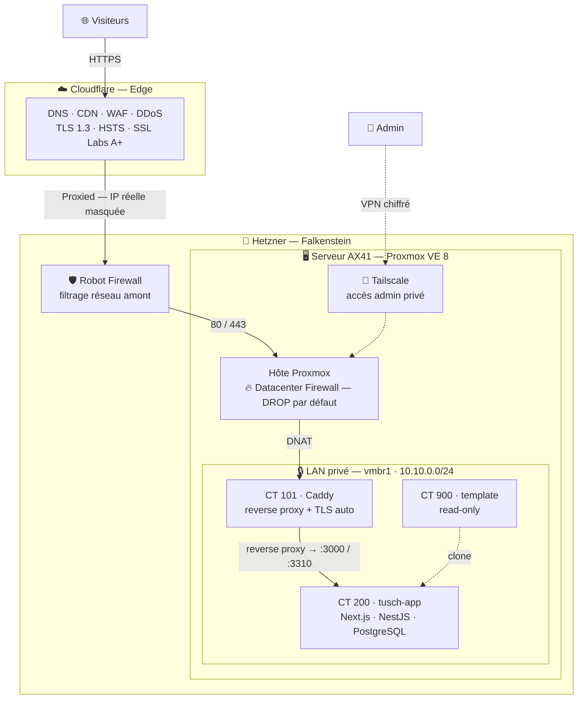

# tusch-infra

**Infrastructure auto-hébergée production-grade.**
Sécurité par défaut, observabilité, reproductibilité.

---

## Contexte

Ce dépôt documente l'infrastructure que je conçois et opère pour héberger
mes projets personnels et professionnels, dont **tusch.mn** (marketplace
de services en cours de développement).

L'objectif n'est pas un homelab de loisir, mais une infrastructure
proche du niveau production réel, conçue avec les exigences d'un
Administrateur d'Infrastructures Sécurisées (AIS).

> Formation : Technicien Supérieur Systèmes, Réseaux et Cybersécurité (Studi).
> Objectif : alternance AIS à partir de septembre 2026.

---

## Architecture en un coup d'œil

| Couche | Composants |
|--------|------------|
| Edge   | Cloudflare (DNS, CDN, WAF, DDoS) |
| Reverse proxy | Caddy 2 (TLS automatique, HSTS, A+ SSL Labs) |
| Hyperviseur | Proxmox VE 8 sur Debian 12 |
| Sécurité | OPNsense, fail2ban, Tailscale (admin), Wazuh (à venir) |
| Stockage | LVM-thin sur loopback (snapshots LXC), RAID 1 mdadm |
| Backups | vzdump + restic vers Hetzner Storage Box |
| Monitoring | Prometheus + Grafana + Loki (à venir) |

---

## Défense en profondeur — 6 couches

1. **Cloudflare** (WAF, CDN, DDoS, TLS edge)
2. **Hetzner Robot Firewall** (filtrage amont au niveau réseau datacenter)
3. **OPNsense + Suricata** (segmentation VLAN, IDS)
4. **Proxmox Datacenter Firewall** (DROP default, security groups)
5. **Hardening SSH + fail2ban** (clés ed25519 uniquement, ban dynamique)
6. **Tailscale** (canal admin chiffré, IP publique non requise pour l'admin)

---

## Stack technique

- **Hyperviseur** : Proxmox VE 8 (community)
- **OS hôte** : Debian 12 Bookworm
- **Conteneurisation** : LXC (Linux) + KVM (Windows lab)
- **Reverse proxy** : Caddy 2
- **VPN admin** : Tailscale
- **Automatisation** : Ansible *(à venir)*
- **CI/CD** : GitHub Actions *(à venir)*
- **Observabilité** : Prometheus, Grafana, Loki *(à venir)*

---

## Contenu du dépôt

| Dossier | Contenu |
|---------|---------|
| `docs/architecture/` | Documentation détaillée par domaine |
| `docs/articles/` | Articles techniques (pièges résolus, retours d'expérience) |
| `docs/pieges-resolus.md` | Index des problèmes résolus pendant la mise en place |
| `proxmox/` | Configurations Proxmox (réseau, firewall, systemd) — anonymisées |
| `caddy/` | Configurations Caddy — anonymisées |
| `diagrams/` | Diagrammes d'architecture (sources Mermaid + exports) |

---

## Articles

*(Liste en cours d'enrichissement — voir `docs/articles/`)*

- Le piège du NAT Proxmox avec firewall actif (fwbr+ zone CT)
- LVM-thin sur loopback pour snapshots LXC sans réinstaller Proxmox
- Architecture homelab Proxmox sécurisée : Tailscale + Cloudflare + Caddy
- Migrer son NAT iptables vers OPNsense sans casser sa prod *(à venir)*

---

## Notes

- Toutes les configurations publiées dans ce dépôt sont **anonymisées**.
  Les fichiers en `.example` contiennent des placeholders à la place
  des IP publiques, fingerprints, secrets, hostnames sensibles.
- Ce dépôt est documenté en français principal — quelques sections
  techniques peuvent contenir de l'anglais selon la terminologie native.

---

## Licence

MIT — voir [LICENSE](LICENSE).

## Auteur

**Darkhansukh G.** — étudiant TSSR, en recherche d'alternance AIS.
