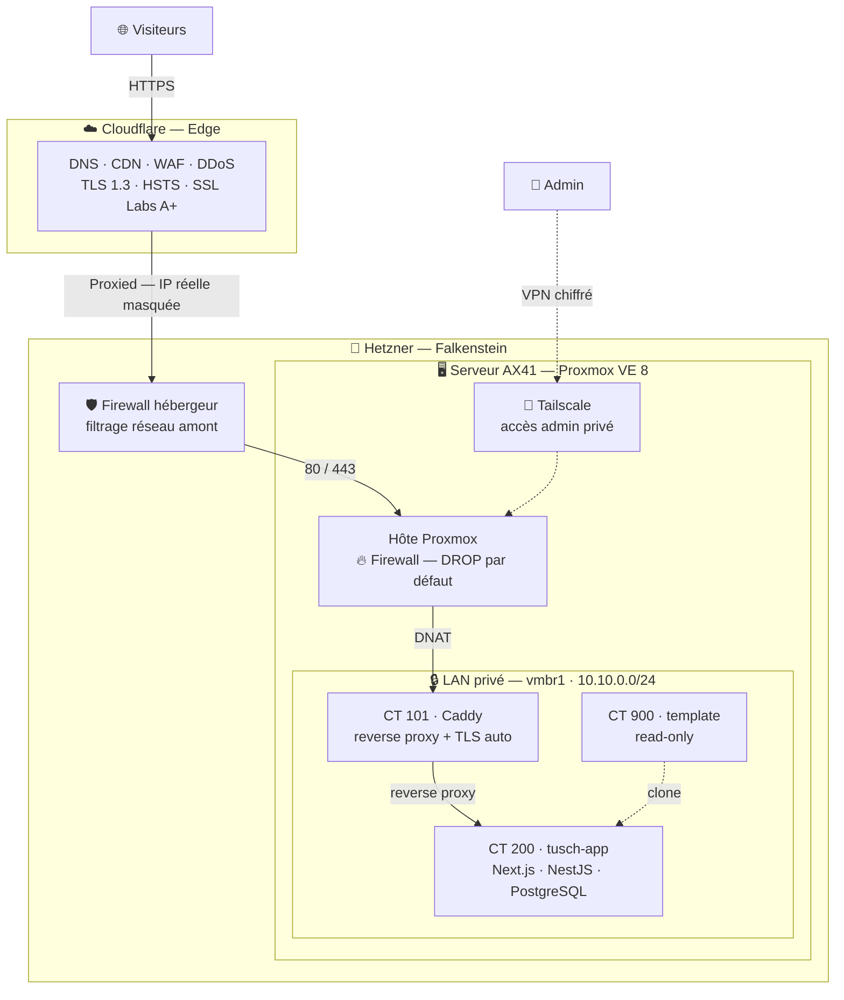

# Vue globale

Document d'entrée de la documentation d'architecture. Il donne la vue
d'ensemble de l'infrastructure ; les couches sont détaillées dans les documents
suivants ([réseau](02-reseau.md), [sécurité](03-securite.md),
[stockage](04-stockage.md)).

---

## Objectif

Une infrastructure auto-hébergée, sécurisée et reproductible, qui sert à la
fois de plateforme d'hébergement (dont le projet tusch.mn) et de terrain
d'apprentissage des compétences d'administration systèmes, réseaux et sécurité.

> Principe directeur : rester **simple, protégé et reproductible**. Chaque choix
> privilégie la clarté et la maintenabilité plutôt que la complexité.

---

## Le serveur

| | |
|---|---|
| **Modèle** | Serveur dédié Hetzner AX41-NVMe |
| **CPU** | AMD Ryzen 5 3600 — 6 cœurs / 12 threads |
| **RAM** | 64 Go |
| **Disques** | 2 × 512 Go NVMe, **RAID 1** logiciel (mdadm) |
| **Datacenter** | Falkenstein (Allemagne) |
| **OS hôte** | Debian 12 Bookworm |
| **Hyperviseur** | Proxmox VE 8 |

Le RAID 1 (miroir) garantit que la panne d'un disque ne provoque pas de perte
de données.

---

## Architecture en couches

---

## Composants et rôles

| Couche | Composant | Rôle |
|--------|-----------|------|
| Edge | Cloudflare | DNS, CDN, WAF, DDoS, TLS edge |
| Réseau | Firewall hébergeur | Filtrage en amont du serveur |
| Hyperviseur | Proxmox VE 8 | Virtualisation (LXC), firewall, stockage |
| Reverse proxy | CT 101 · Caddy | Routage HTTPS, TLS automatique |
| Application | CT 200 · tusch-app | Next.js + NestJS + PostgreSQL |
| Template | CT 900 | Modèle de conteneur read-only (clonage) |
| Admin | Tailscale | Accès d'administration chiffré, hors-bande |

---

## Stack technique

| Domaine | Choix |
|---------|-------|
| Hyperviseur | Proxmox VE 8 (édition no-subscription) |
| OS hôte | Debian 12 Bookworm |
| Stockage | RAID 1 (mdadm) + LVM-thin sur loopback (snapshots LXC) |
| Conteneurisation | LXC |
| Reverse proxy | Caddy 2 (TLS automatique) |
| VPN admin | Tailscale |
| CDN / WAF | Cloudflare |
| Pare-feu | Firewall hébergeur + firewall Proxmox (DROP par défaut) |

---

## Sécurité — défense en profondeur

Six couches de sécurité indépendantes, de l'edge jusqu'à l'accès admin
hors-bande. Le détail est dans [`03-securite.md`](03-securite.md).

L'idée centrale : **si une couche tombe, les autres protègent.**

---

## Documentation détaillée

| Document | Contenu |
|----------|---------|
| [`02-reseau.md`](02-reseau.md) | Bridges WAN/LAN, NAT, DNAT, plan d'adressage |
| [`03-securite.md`](03-securite.md) | Les 6 couches de défense en profondeur |
| [`04-stockage.md`](04-stockage.md) | LVM-thin sur loopback, snapshots LXC |
| [`../pieges-resolus.md`](../pieges-resolus.md) | Problèmes rencontrés et résolus |
| [`../../proxmox/`](../../proxmox/) | Configurations Proxmox (réseau, firewall, systemd) |
| [`../../caddy/`](../../caddy/) | Configuration du reverse proxy |

---

## État et perspectives

**En place** : virtualisation Proxmox, réseau segmenté (WAN/LAN privé), reverse
proxy HTTPS (A+ SSL Labs), défense en profondeur 6 couches, stockage avec
snapshots, accès admin via VPN.

**À venir** : segmentation réseau avancée (OPNsense + VLANs + IDS),
observabilité (Prometheus / Grafana / Loki), sauvegardes externes chiffrées,
automatisation (Ansible), SSO centralisé (Authentik), SIEM (Wazuh).